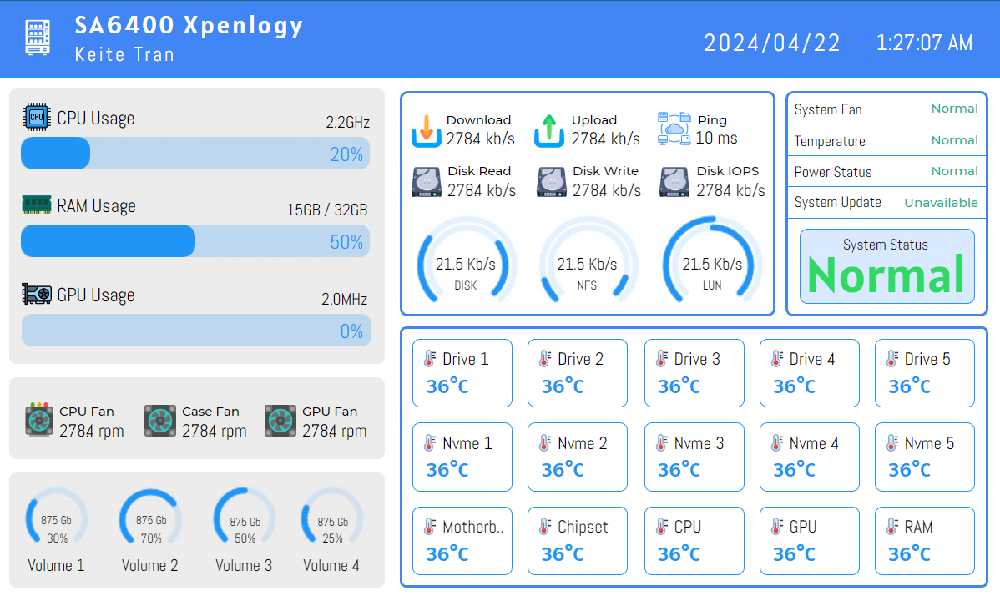
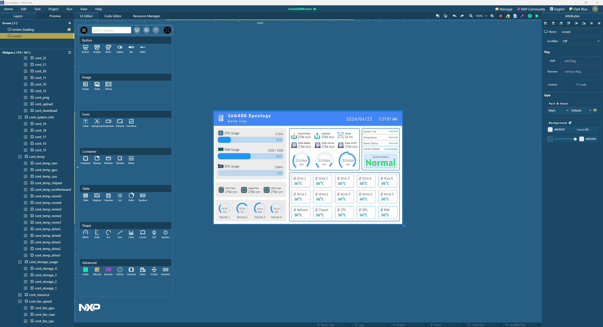
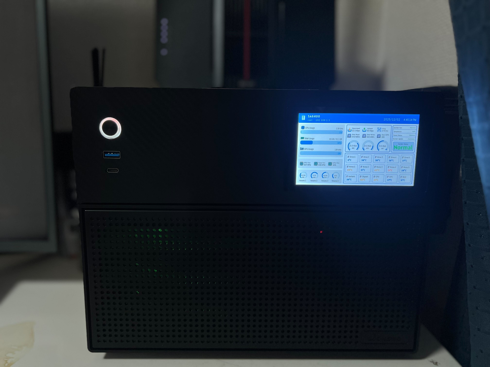

# Màn Hình Jonsbo N4

[English](README.md) | [Tiếng Việt](README.vi.md)

Hệ thống màn hình tùy chỉnh cho vỏ máy tính Jonsbo N4, được xây dựng với ESP32-P4 và LVGL, được thiết kế để giám sát và hiển thị thông tin hệ thống theo thời gian thực.


## 🎯 Tổng Quan

Dự án **Màn Hình Jonsbo N4** biến vỏ máy tính của bạn thành một hệ thống giám sát thông minh với màn hình cảm ứng đẹp mắt. Được xây dựng trên vi điều khiển ESP32-P4 mạnh mẽ và tận dụng khả năng đồ họa tiên tiến của LVGL, hệ thống này cung cấp khả năng hiển thị trực quan thời gian thực về các thông số quan trọng của máy tính bạn.

### Tại Sao Chọn Dự Án Này?

- **Tích Hợp Liền Mạch**: Được thiết kế đặc biệt cho mặt trước vỏ Jonsbo N4
- **Giao Diện Chuyên Nghiệp**: Được tạo bằng GUI Guider của NXP cho giao diện hiện đại, tinh tế
- **Dữ Liệu Thời Gian Thực**: Giám sát CPU, GPU, RAM, nhiệt độ và nhiều hơn nữa chỉ trong nháy mắt
- **Mã Nguồn Mở**: Hoàn toàn có thể tùy chỉnh và mở rộng theo nhu cầu của bạn
- **Phát Triển Dễ Dàng**: Bao gồm trình mô phỏng để kiểm tra mà không cần phần cứng

### Điểm Nổi Bật

- 🎨 **Giao Diện Đẹp Mắt**: Thiết kế UI hiện đại, đáp ứng với các hiệu ứng chuyển động mượt mà
- 📊 **Giám Sát Toàn Diện**: Theo dõi tất cả các thông số hệ thống theo thời gian thực
- 🖐️ **Hỗ Trợ Cảm Ứng**: Giao diện cảm ứng điện dung trực quan
- 🔌 **Giao Tiếp USB**: Truyền dữ liệu nhanh qua USB CDC
- 🎮 **LVGL v9**: Thư viện đồ họa mới nhất với tăng tốc phần cứng
- 🛠️ **GUI Guider**: Trình chỉnh sửa UI trực quan để tùy chỉnh dễ dàng

## 📋 Mục Lục

- [Tổng Quan](#tổng-quan)
- [Ảnh Chụp Màn Hình](#ảnh-chụp-màn-hình)
- [Nơi Mua Phần Cứng](#nơi-mua-phần-cứng)
- [Tính Năng](#tính-năng)
- [Yêu Cầu Phần Cứng](#yêu-cầu-phần-cứng)
- [Yêu Cầu Phần Mềm](#yêu-cầu-phần-mềm)
- [Bắt Đầu Nhanh](#bắt-đầu-nhanh)
- [Cài Đặt](#cài-đặt)
- [Biên Dịch](#biên-dịch)
- [Sử Dụng](#sử-dụng)
- [Cấu Trúc Dự Án](#cấu-trúc-dự-án)
- [Cấu Hình](#cấu-hình)
- [Kiến Trúc](#kiến-trúc)
- [Phát Triển](#phát-triển)
- [Khắc Phục Sự Cố](#khắc-phục-sự-cố)
- [Đóng Góp](#đóng-góp)
- [Giấy Phép](#giấy-phép)
- [Liên Kết](#liên-kết)

## ✨ Tính Năng

### Màn Hình & Giao Diện
- 🎨 **UI Hiện Đại**: Giao diện đẹp mắt dựa trên LVGL v9 với các hiệu ứng mượt mà
- 🖐️ **Cảm Ứng Điện Dung**: Bộ điều khiển cảm ứng GT911 cho tương tác trực quan
- 📺 **Màn Hình MIPI DSI**: Màn hình chất lượng cao với bộ điều khiển JD9365
- 🔄 **Thiết Kế Đáp Ứng**: Được tối ưu hóa cho góc xoay 270 độ
- ⚡ **60 FPS**: Tốc độ làm mới mượt mà với khoảng thời gian 16ms

### Giám Sát Hệ Thống
- 🖥️ **Giám Sát CPU**: Sử dụng, nhiệt độ và tần số thời gian thực
- 🎮 **Theo Dõi GPU**: Thống kê card đồ họa và nhiệt độ
- 💾 **Sử Dụng Bộ Nhớ**: Thống kê RAM và bộ nhớ hệ thống
- 🌡️ **Cảm Biến Nhiệt Độ**: Nhiệt độ CPU, GPU và hệ thống
- 🌀 **Điều Khiển Quạt**: Giám sát tốc độ quạt và RPM
- 💿 **Thông Tin Lưu Trữ**: Thống kê sử dụng ổ đĩa và I/O
- 🔌 **Thống Kê Năng Lượng**: Giám sát tiêu thụ năng lượng (nếu có)

### Truyền Thông & Dữ Liệu
- 🔌 **USB CDC**: Truyền thông USB nhanh để truyền dữ liệu
- 🐍 **Máy Chủ Python**: Máy chủ thu thập dữ liệu cảm biến linh hoạt (không cần pip dependencies!)
- 🖥️ **Synology NAS**: Hỗ trợ tích hợp với Task Scheduler
- 📡 **Hỗ Trợ SNMP**: Khả năng giám sát thiết bị mạng
- 🔄 **Cập Nhật Thời Gian Thực**: Tốc độ làm mới dữ liệu dưới một giây
- 📊 **Dữ Liệu Mô Phỏng**: Chế độ kiểm tra với dữ liệu giả lập

### Công Cụ Phát Triển
- 🖥️ **Trình Mô Phỏng LVGL**: Kiểm tra UI mà không cần phần cứng
- 🎨 **GUI Guider**: Trình chỉnh sửa trực quan cho thiết kế UI
- 🔧 **CMake Build**: Hệ thống build chuẩn
- 📝 **ESP-IDF v5.5**: Hỗ trợ framework ESP mới nhất

## 📸 Ảnh Chụp Màn Hình

### Ứng Dụng Đang Chạy
Màn hình giám sát hiển thị thông tin hệ thống theo thời gian thực với giao diện hiện đại, gọn gàng.



### Trình Chỉnh Sửa GUI Guider
Trình chỉnh sửa UI trực quan hiển thị quá trình thiết kế bằng công cụ GUI Guider của NXP.



### Lắp Đặt Phần Cứng
Sản phẩm hoàn thiện được lắp đặt trong vỏ Jonsbo N4, hiển thị màn hình đang hoạt động.



## 🛒 Nơi Mua Phần Cứng

Sẵn sàng xây dựng của riêng bạn? Đây là các linh kiện cần thiết:

### 🖨️ Adapter Vỏ In 3D
> **Adapter Mặt Trước Jonsbo N4**  
> Tải xuống mô hình 3D và tự in, hoặc đặt hàng từ dịch vụ in 3D.  
> 🔗 [Lấy Mô Hình 3D trên Printables](https://www.printables.com/model/1501258-jonsbo-n4-front-panel-custom)

### 📺 Board Phát Triển ESP32-P4 với Màn Hình
> **ESP32-P4 với Màn Hình LCD MIPI DSI**  
> Board phát triển hoàn chỉnh với màn hình tích hợp, bộ điều khiển cảm ứng và MCU ESP32-P4.  
> 🔗 [Mua trên AliExpress](https://ja.aliexpress.com/item/1005009618259341.html?spm=a2g0o.order_list.order_list_main.47.4aea1802AEhWxO&gatewayAdapt=glo2jpn)

### 💡 Những Gì Bạn Cần
- Board phát triển ESP32-P4 (link ở trên)
- Adapter mặt trước in 3D
- Cáp USB-C cho nguồn và dữ liệu
- Vỏ máy tính Jonsbo N4

## 🔧 Yêu Cầu Phần Cứng

### Linh Kiện Chính

- **MCU**: ESP32-P4 (Dual-core RISC-V, lên đến 400MHz)
- **Màn Hình**: MIPI DSI LCD (bộ điều khiển JD9365 với ST7701)
- **Cảm Ứng**: Bộ điều khiển cảm ứng điện dung GT911 (I2C)
- **Flash**: Bộ nhớ flash ngoài 16MB
- **PSRAM**: PSRAM ngoài (200MHz, 8MB hoặc nhiều hơn)
- **Giao Diện**: USB-C cho nguồn và truyền dữ liệu
- **Vỏ**: Mặt Trước Jonsbo N4

### Thông Số Kỹ Thuật

| Linh Kiện | Thông Số |
|-----------|----------|
| MCU | ESP32-P4 @ 400MHz |
| Màn Hình | MIPI DSI, màu RGB |
| Cảm Ứng | GT911 (cảm ứng điện dung 10 điểm) |
| Bộ Nhớ | 16MB Flash + 8MB PSRAM |
| Truyền Thông | USB 2.0 Full Speed (CDC) |
| Nguồn | 5V qua USB-C |

## 💻 Yêu Cầu Phần Mềm

- **ESP-IDF**: v5.5 hoặc mới hơn
- **Python**: 3.7+ (cho máy chủ cảm biến, không cần gói ngoài)
- **CMake**: 3.16 hoặc mới hơn
- **Git**: Để clone dependencies
- **Thiết Kế UI**: [GUI Guider](https://www.nxp.jp/design/design-center/software/development-software/gui-guider:GUI-GUIDER)
- **Hệ Điều Hành Máy Chủ Cảm Biến**: Linux (được kiểm tra trên Synology NAS DSM 7.x)

### Cài Đặt ESP-IDF

1. Tải xuống và cài đặt ESP-IDF v5.5:
   ```bash
   # Windows
   C:\Espressif\frameworks\esp-idf-v5.5\export.bat
   
   # Linux/Mac
   . $HOME/esp/esp-idf/export.sh
   ```

2. Xác minh cài đặt:
   ```bash
   idf.py --version
   ```

## 🚀 Bắt Đầu Nhanh

Khởi động và chạy trong vài phút:

```bash
# 1. Thiết lập môi trường ESP-IDF
C:\Espressif\frameworks\esp-idf-v5.5\export.bat

# 2. Clone dự án
git clone https://github.com/keitetran/JonsboN4Monitor.git
cd JonsboN4Monitor

# 3. Tạo cấu hình local của bạn
copy sdkconfig.example sdkconfig  # Windows
# cp sdkconfig.example sdkconfig  # Linux/Mac

# 4. Cấu hình WiFi/MQTT (Quan trọng!)
idf.py menuconfig
# Điều hướng đến: Component config → HomeLabMonitor Configuration
# Đặt SSID và Password WiFi của bạn

# 5. Đặt target và build
idf.py set-target esp32p4
idf.py build

# 6. Flash vào thiết bị
idf.py -p COM3 flash monitor

# 7. Khởi động máy chủ cảm biến (trong terminal khác)
cd server
sudo python3 read_sensor.py  # Cần quyền root để truy cập cảm biến

# Đối với Synology NAS: Sử dụng Task Scheduler (xem phần Sử Dụng)
```

Vậy là xong! Màn hình của bạn bây giờ sẽ hiển thị thông tin hệ thống.

## 📦 Cài Đặt

1. Clone repository:
   ```bash
   git clone https://github.com/keitetran/JonsboN4Monitor.git
   cd JonsboN4Monitor
   ```

2. Khởi tạo submodules (nếu có):
   ```bash
   git submodule update --init --recursive
   ```

3. **Không cần dependencies Python!** Máy chủ chỉ sử dụng các thư viện tích hợp sẵn của Python 3.

## 🏗️ Biên Dịch

### Sử Dụng idf.py (Được Khuyến Nghị)

```bash
# Đặt target
idf.py set-target esp32p4

# Cấu hình (tùy chọn)
idf.py menuconfig

# Build
idf.py build

# Flash
idf.py -p COM3 flash

# Monitor
idf.py -p COM3 monitor
```

### Sử Dụng CMake Trực Tiếp

⚠️ **Lưu ý**: Bạn phải thiết lập môi trường ESP-IDF trước:

```bash
# Windows
C:\Espressif\frameworks\esp-idf-v5.5\export.bat

# Sau đó chạy CMake
mkdir build
cd build
cmake ..
cmake --build .
```

## 🚀 Sử Dụng

### Chạy Máy Chủ Cảm Biến

Máy chủ Python thu thập dữ liệu cảm biến từ hệ thống Linux và gửi đến ESP32.

📖 **Hướng Dẫn Chi Tiết**: Xem [server/README.md](server/README.md) để biết hướng dẫn đầy đủ.

#### Phương Pháp 1: Chạy Thủ Công (Kiểm Tra)

```bash
cd server
sudo python3 read_sensor.py
```

**Lưu ý**: Cần `sudo` (root) để đọc cảm biến phần cứng.

#### Phương Pháp 2: Task Scheduler Synology NAS (Được Khuyến Nghị cho Production)

Để tự động khởi động trên Synology NAS:

1. **Mở Control Panel** → **Task Scheduler**

2. **Create** → **Scheduled Task** → **User-defined script**

3. **Cài Đặt Chung**:
   - Tên task: `ESP32 Monitor Server`
   - User: `root` (quan trọng để truy cập cảm biến)
   - Enabled: ✓

4. **Lịch Trình**:
   - Chạy vào các ngày sau: Hàng ngày
   - Thời gian chạy đầu tiên: 00:00
   - Tần suất: Mỗi phút (hoặc theo nhu cầu)
   - HOẶC chọn: **Run on boot-up** (được khuyến nghị)

5. **Cài Đặt Task** → **Run command**:
   ```bash
   # User-defined script
   /usr/bin/python3 /volume1/your_path/HomeLabMonitor/server/read_sensor.py
   ```

   **Tìm đường dẫn của bạn trên Synology**:
   - Nếu bạn clone vào thư mục chia sẻ "homes": `/volume1/homes/username/HomeLabMonitor/server/read_sensor.py`
   - Nếu bạn clone vào thư mục "docker": `/volume1/docker/HomeLabMonitor/server/read_sensor.py`
   - Sử dụng SSH và lệnh `pwd` để tìm đường dẫn chính xác
   
   Thay thế `/volume1/your_path/` bằng đường dẫn cài đặt thực tế của bạn.

6. **Cài Đặt Nâng Cao**:
   - Gửi chi tiết chạy qua email: Tùy chọn
   - Chỉ gửi chi tiết chạy khi script kết thúc bất thường: ✓

7. Nhấp **OK** để lưu.

8. **Kiểm tra task**: Click chuột phải → **Run** để kiểm tra ngay lập tức.

#### Phương Pháp 3: Linux systemd Service

Đối với các hệ thống Linux khác, tạo một systemd service:

```bash
sudo nano /etc/systemd/system/esp32-monitor.service
```

Thêm:

```ini
[Unit]
Description=ESP32 Home Lab Monitor Server
After=network.target

[Service]
Type=simple
User=root
WorkingDirectory=/path/to/HomeLabMonitor/server
ExecStart=/usr/bin/python3 /path/to/HomeLabMonitor/server/read_sensor.py
Restart=always
RestartSec=10

[Install]
WantedBy=multi-user.target
```

Kích hoạt và khởi động:

```bash
sudo systemctl daemon-reload
sudo systemctl enable esp32-monitor
sudo systemctl start esp32-monitor
sudo systemctl status esp32-monitor
```

### Trình Mô Phỏng

Để phát triển và kiểm tra mà không cần phần cứng:

```bash
cd lvgl-simulator
make
./simulator
```

## 📁 Cấu Trúc Dự Án

```
JonsboN4Monitor/
├── main/                  # Mã ứng dụng chính
├── custom/                # LVGL port tùy chỉnh và giao tiếp host
├── generated/             # Mã GUI tự động tạo từ GUI-Guider
│   ├── gui_guider.c/h     # Logic GUI chính
│   ├── widgets_init.c/h   # Khởi tạo widget
│   ├── events_init.c/h    # Xử lý sự kiện
│   └── images/            # Hình ảnh nhúng
├── server/                # Máy chủ cảm biến Python
│   ├── read_sensor.py     # Đọc cảm biến chính
│   ├── send_mock.py       # Gửi dữ liệu mô phỏng
│   └── snmpwalk.py        # Đọc cảm biến SNMP
├── lvgl/                  # Thư viện đồ họa LVGL
├── lvgl-simulator/        # Trình mô phỏng LVGL để phát triển
├── docs/                  # Tài liệu và ánh xạ cảm biến
├── import/                # Assets (fonts, images)
│   ├── font/              # File font TTF
│   └── image/             # Hình ảnh PNG/GIF
├── CMakeLists.txt         # Cấu hình CMake chính
├── sdkconfig.defaults     # Cấu hình ESP-IDF mặc định
└── partitions.csv         # Bảng phân vùng flash
```

## ⚙️ Cấu Hình

### Cấu Hình WiFi & MQTT

**⚠️ Quan trọng**: Trước khi build, bạn cần cấu hình WiFi và cài đặt MQTT.

#### Bước 1: Tạo Cấu Hình Local

Repository cung cấp `sdkconfig.example` với các giá trị placeholder. Bạn cần tạo cấu hình local riêng:

```bash
# Windows
copy sdkconfig.example sdkconfig

# Linux/Mac
cp sdkconfig.example sdkconfig
```

**Lưu ý**: `sdkconfig` nằm trong `.gitignore`, nên mật khẩu của bạn sẽ không bao giờ được commit!

#### Bước 2: Cấu Hình Cài Đặt Của Bạn

**Tùy Chọn A: Sử Dụng menuconfig (Được Khuyến Nghị)**

```bash
idf.py menuconfig
```

Điều hướng đến:
- **Component config → HomeLabMonitor Configuration**
  - Đặt WiFi SSID của bạn
  - Đặt Password WiFi của bạn
  - Đặt IP MQTT Broker (nếu sử dụng MQTT)
  - Đặt thông tin đăng nhập MQTT (nếu cần)

**Tùy Chọn B: Chỉnh Sửa Trực Tiếp**

Chỉnh sửa file `sdkconfig` và thay đổi các giá trị này:

```ini
CONFIG_WIFI_SSID="Ten_WiFi_Cua_Ban"
CONFIG_WIFI_PASSWORD="Mat_Khau_WiFi_Cua_Ban"
CONFIG_MQTT_BROKER_IP="192.168.1.x"
CONFIG_MQTT_USERNAME="ten_nguoi_dung"  # Tùy chọn
CONFIG_MQTT_PASSWORD="mat_khau"  # Tùy chọn
```

#### Cách Nó Hoạt Động

```
GitHub Repository          Máy Local Của Bạn
─────────────────         ──────────────────
sdkconfig.example    →    Copy →    sdkconfig
(placeholders)                       (mật khẩu thật của bạn)
✓ Committed to Git                   ✗ Ignored by Git (.gitignore)
```

- `sdkconfig.example` = Template với placeholders (committed to Git)
- `sdkconfig` = Cấu hình local của bạn với mật khẩu thật (ignored by Git)
- Mỗi developer có `sdkconfig` riêng với mật khẩu riêng
- Dữ liệu nhạy cảm của bạn chỉ ở trên máy của bạn! 🔒

### Cấu Hình Màn Hình

Màn hình được cấu hình cho:
- **Xoay**: 270 độ
- **Độ Phân Giải**: Được định nghĩa bởi bộ điều khiển LCD
- **Tốc Độ Làm Mới**: 16ms (60 FPS)
- **Tránh Rách Màn Hình**: Chế độ 3 được kích hoạt

### Ánh Xạ Cảm Biến

Ánh xạ dữ liệu cảm biến được định nghĩa trong `docs/sensor-mapping.txt`. Hệ thống hỗ trợ:
- Nhiệt độ và sử dụng CPU
- Nhiệt độ và sử dụng GPU
- Sử dụng RAM
- Nhiệt độ hệ thống
- Tốc độ quạt
- Và nhiều hơn nữa...

### Bảng Phân Vùng

Bảng phân vùng tùy chỉnh được định nghĩa trong `partitions.csv`:
- **Bootloader**: ESP32 bootloader
- **NVS**: Lưu trữ không bay hơi cho cấu hình
- **Application**: Firmware chính (lên đến 16MB)
- **OTA**: Phân vùng cập nhật qua mạng (nếu được kích hoạt)

### Giao Tiếp USB

Hệ thống sử dụng USB CDC (Communication Device Class) để truyền dữ liệu:
- **Tốc Độ**: USB 2.0 Full Speed (12 Mbps)
- **Giao Thức**: Giao thức dựa trên gói tùy chỉnh
- **Định Dạng Dữ Liệu**: Gói dữ liệu cảm biến nhị phân
- **Độ Trễ**: < 100ms khoảng thời gian cập nhật

## 🏗️ Kiến Trúc

### Tổng Quan Hệ Thống

```
┌─────────────────┐         USB CDC          ┌──────────────────┐
│   Host PC       │◄─────────────────────────►│   ESP32-P4       │
│  (Linux/Win)    │      Dữ Liệu Cảm Biến    │   Vi Điều Khiển  │
└─────────────────┘                          └──────────────────┘
        │                                             │
        │                                             │
   ┌────▼────┐                                   ┌────▼─────┐
   │ Máy Chủ │                                   │  LVGL    │
   │ Python  │                                   │  GUI     │
   └─────────┘                                   └──────────┘
        │                                             │
   ┌────▼────────┐                             ┌─────▼──────┐
   │  Cảm Biến   │                             │  MIPI DSI  │
   │ (lm-sensors)│                             │  Màn Hình  │
   └─────────────┘                             └────────────┘
```

### Luồng Dữ Liệu

1. **Thu Thập Cảm Biến**: Máy chủ Python đọc cảm biến hệ thống (CPU, GPU, nhiệt độ, v.v.)
2. **Truyền Dữ Liệu**: Máy chủ gửi dữ liệu qua USB CDC đến ESP32
3. **Xử Lý Dữ Liệu**: ESP32 phân tích và xác thực dữ liệu đến
4. **Cập Nhật UI**: LVGL cập nhật các widget màn hình với giá trị mới
5. **Đầu Vào Cảm Ứng**: Tương tác người dùng được xử lý và phản hồi

### Các Lớp Component

```
┌─────────────────────────────────────┐
│      Lớp Ứng Dụng                   │  ← Logic chính, xử lý cảm biến
├─────────────────────────────────────┤
│      Lớp Đồ Họa LVGL                │  ← Render UI, widgets
├─────────────────────────────────────┤
│      Lớp ESP-IDF HAL                │  ← Trừu tượng hóa phần cứng
├─────────────────────────────────────┤
│      Lớp Phần Cứng                  │  ← ESP32-P4, LCD, Touch
└─────────────────────────────────────┘
```

## 💻 Phát Triển

### Yêu Cầu Để Phát Triển

- ESP-IDF v5.5+ (được cấu hình đúng)
- Python 3.11+ với pip
- Git để quản lý version
- GUI Guider (để chỉnh sửa UI)
- Trình soạn thảo code (khuyến nghị VS Code)

### Quy Trình Phát Triển

1. **Thiết Kế UI**:
   ```bash
   # Mở project trong GUI Guider
   # Chỉnh sửa các phần tử UI
   # Export vào thư mục generated/
   ```

2. **Phát Triển Code**:
   ```bash
   # Build và flash
   idf.py build flash monitor
   
   # Hoặc sử dụng simulator để lặp nhanh hơn
   cd lvgl-simulator
   make && ./simulator
   ```

3. **Kiểm Tra**:
   ```bash
   # Kiểm tra với dữ liệu mô phỏng
   cd server
   python send_mock.py
   ```

### Chỉnh Sửa UI

UI được thiết kế với GUI Guider:

1. Mở GUI Guider và load project
2. Chỉnh sửa widgets, thêm màn hình mới, hoặc thay đổi styles
3. Export project (tạo thư mục `generated/`)
4. Build và flash để xem thay đổi

**File Quan Trọng**:
- `generated/gui_guider.c/h`: Khởi tạo GUI chính
- `generated/events_init.c`: Xử lý sự kiện cho nút/cảm ứng
- `custom/usb_comm.c`: Giao tiếp USB và phân tích cảm biến

### Thêm Cảm Biến Mới

1. **Phía Máy Chủ** (`server/read_sensor.py`):
   ```python
   # Thêm logic đọc cảm biến
   new_sensor_value = read_new_sensor()
   ```

2. **Phía ESP32** (`custom/usb_comm.c`):
   ```c
   // Thêm ID cảm biến trong enum
   // Thêm logic phân tích
   // Cập nhật UI widget
   ```

3. **Cập Nhật UI** (trong GUI Guider):
   - Thêm label/chart cho cảm biến mới
   - Export và rebuild

## 🐛 Khắc Phục Sự Cố

### Vấn Đề Build

**Vấn đề**: `idf.py not found`
```bash
# Giải pháp: Source môi trường ESP-IDF
C:\Espressif\frameworks\esp-idf-v5.5\export.bat
```

**Vấn đề**: `CMake error: target not set`
```bash
# Giải pháp: Đặt target trước khi build
idf.py set-target esp32p4
```

**Vấn đề**: `Out of memory during build`
```bash
# Giải pháp: Tăng kích thước phân vùng trong partitions.csv
# Hoặc giảm embedded assets
```

### Vấn Đề Phần Cứng

**Vấn đề**: Màn hình không hoạt động
- Kiểm tra kết nối MIPI DSI
- Xác minh nguồn cấp (5V, dòng đủ)
- Kiểm tra `sdkconfig` cho cài đặt màn hình

**Vấn đề**: Cảm ứng không phản hồi
- Xác minh địa chỉ GT911 I2C
- Kiểm tra nguồn bộ điều khiển cảm ứng
- Hiệu chỉnh cảm ứng nếu cần

**Vấn đề**: USB không được nhận dạng
- Cài đặt driver USB CDC (Windows)
- Kiểm tra cáp USB (phải hỗ trợ dữ liệu)
- Xác minh cổng COM trong Device Manager

### Vấn Đề Runtime

**Vấn đề**: Không có dữ liệu trên màn hình
```bash
# Kiểm tra máy chủ cảm biến đang chạy
cd server
sudo python3 read_sensor.py

# Kiểm tra kết nối USB
# Windows: Device Manager → COM ports
# Linux: ls /dev/ttyACM*
```

**Vấn đề**: Màn hình chậm/giật
- Giảm tần suất cập nhật trong máy chủ
- Kiểm tra chất lượng cáp USB
- Tối ưu cài đặt buffer LVGL

**Vấn đề**: Giá trị cảm biến không đúng
- Kiểm tra ánh xạ cảm biến trong `docs/sensor-mapping.txt`
- Xác minh máy chủ đang đọc cảm biến đúng
- Kiểm tra endianness của gói dữ liệu

### Vấn Đề Synology NAS

**Vấn đề**: Task không khởi động khi boot
- Đảm bảo bạn đã chọn "Run on the following boot-up" trong cài đặt Schedule
- Kiểm tra task đang sử dụng user `root` (không phải user thông thường của bạn)
- Xác minh đường dẫn Python3: `/usr/bin/python3` (sử dụng `which python3` qua SSH)

**Vấn đề**: Task thất bại khi chạy
```bash
# Kiểm tra thủ công qua SSH trước
cd /volume1/your_path/HomeLabMonitor/server
sudo /usr/bin/python3 read_sensor.py

# Kiểm tra xem cảm biến có thể đọc được không
sudo sensors

# Nếu lệnh sensors không tìm thấy, cài đặt lm-sensors:
# (Thường được cài sẵn trên Synology)
```

**Vấn đề**: Không thể tìm thấy thiết bị USB ESP32
```bash
# Kiểm tra xem thiết bị có kết nối không
ls -l /dev/ttyACM*

# Hoặc kiểm tra với:
dmesg | grep tty

# Đảm bảo thiết bị USB được pass through nếu dùng VM/Docker
```

**Vấn đề**: Lỗi permission denied
- Task phải chạy với user `root`
- Một số file cảm biến cần quyền root
- Kiểm tra quyền file: `ls -l /sys/class/hwmon/`

### Lỗi Thường Gặp

```bash
# Lỗi: "idf_component_register" not found
# Giải pháp: Phải dùng idf.py, không phải cmake thông thường

# Lỗi: "GT911 not found"
# Giải pháp: Kiểm tra dây I2C và pull-ups

# Lỗi: "Guru Meditation Error"
# Giải pháp: Kiểm tra kích thước stack, cấp phát bộ nhớ
```

## 🔮 Kế Hoạch Tương Lai

- [ ] Kết nối WiFi để giám sát không dây
- [ ] Giao diện web để cấu hình
- [ ] Hỗ trợ nhiều màn hình/trang
- [ ] Themes và color schemes tùy chỉnh
- [ ] Ghi nhật ký và biểu đồ dữ liệu lịch sử
- [ ] Cập nhật firmware OTA
- [ ] Ứng dụng di động để giám sát từ xa
- [ ] Hỗ trợ cho các mẫu vỏ khác

## 🤝 Đóng Góp

Chào đón mọi đóng góp! Vui lòng gửi Pull Request.

1. Fork repository
2. Tạo feature branch của bạn (`git checkout -b feature/TinhNangTuyetVoi`)
3. Commit thay đổi của bạn (`git commit -m 'Thêm TinhNangTuyetVoi'`)
4. Push lên branch (`git push origin feature/TinhNangTuyetVoi`)
5. Mở Pull Request

## 📄 Giấy Phép

Dự án này được cấp phép theo Giấy phép MIT - xem file [LICENSE.txt](LICENSE.txt) để biết chi tiết.

## 🔗 Liên Kết

- [Mô Hình 3D Mặt Trước Jonsbo N4](https://www.printables.com/model/1298708-jonsbo-n4-front-panel)
- [Tài Liệu ESP-IDF](https://docs.espressif.com/projects/esp-idf/en/latest/)
- [Tài Liệu LVGL](https://docs.lvgl.io/)
- [GUI-Guider](https://www.nxp.com/design/software/development-software/gui-guider)

## 📝 Ghi Chú

- Đảm bảo đặt `IDF_TARGET=esp32p4` trước khi build
- Dự án sử dụng LVGL v9 với triển khai port tùy chỉnh
- Hiệu chỉnh cảm ứng có thể cần thiết cho lần thiết lập đầu tiên
- Máy chủ cảm biến phải chạy trên hệ thống host để hiển thị dữ liệu

---

**Được làm với ❤️ cho cộng đồng Jonsbo N4**

